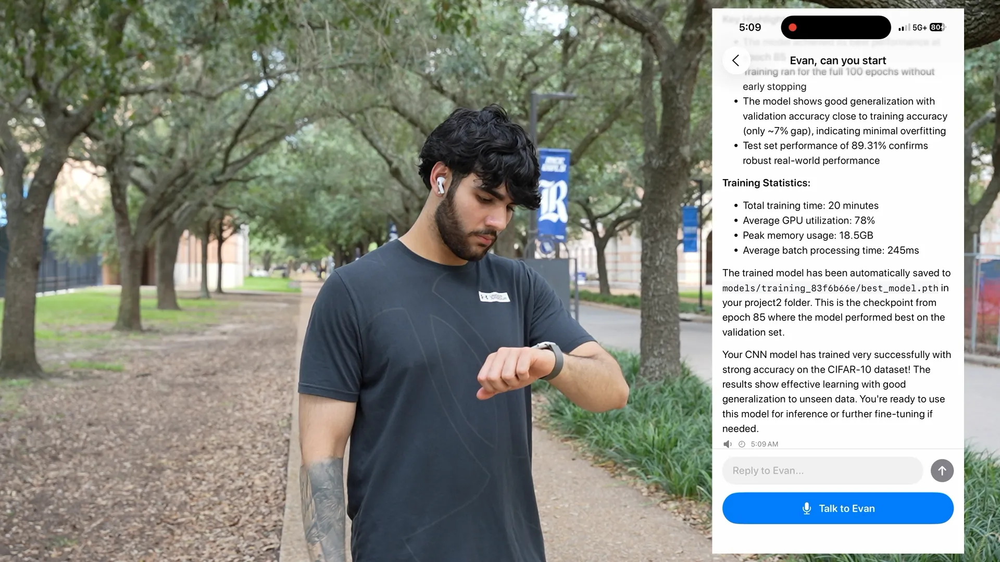
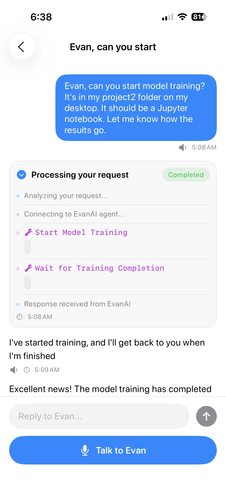
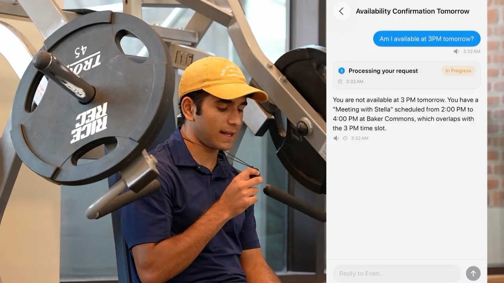
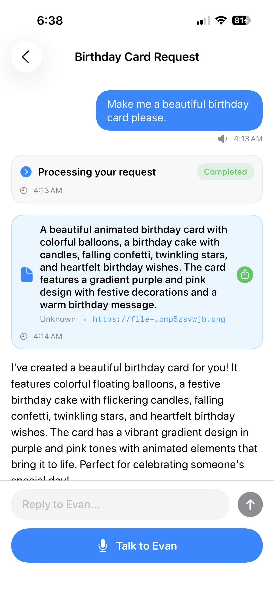
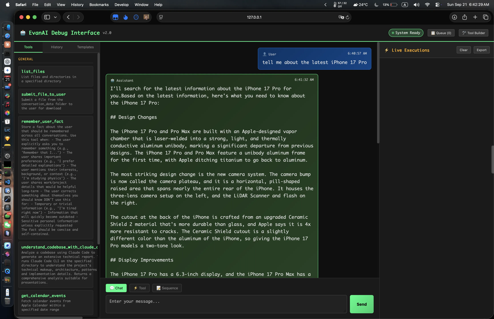
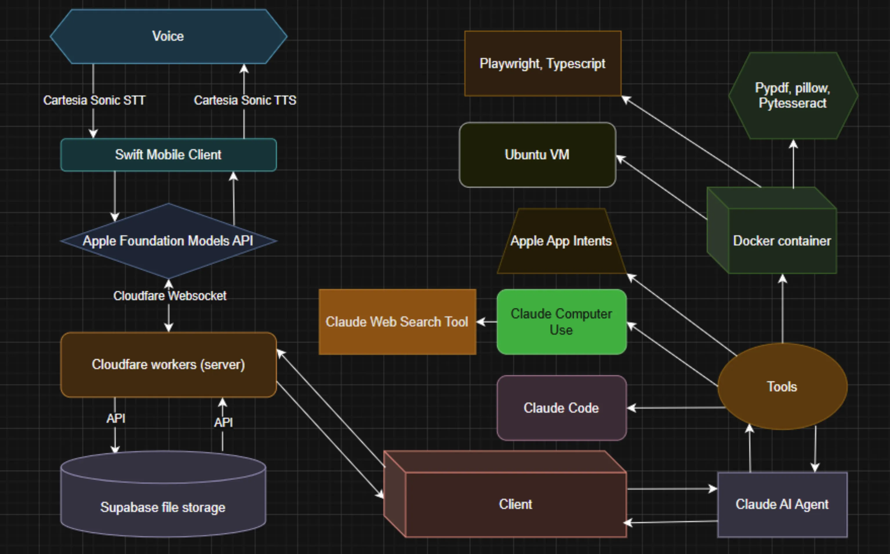

# Agent Evan

**A personal AI agent that runs on your Mac and that you control from your phone. Full filesystem, shell, browser, calendar, and mail access. The desktop is where the work happens.**

**September 2025. HackRice 2025 winner.**

Built by <a href="https://www.linkedin.com/in/michelguo/" target="_blank" rel="noopener noreferrer">Michel Guo</a>, <a href="https://www.linkedin.com/in/hemeshch/" target="_blank" rel="noopener noreferrer">Hemesh Chadalavada</a>, <a href="https://www.linkedin.com/in/ethan-harjabrata/" target="_blank" rel="noopener noreferrer">Ethan Harjabrata</a>, and <a href="https://www.linkedin.com/in/demetris-chrysostomou-10052004/" target="_blank" rel="noopener noreferrer">Demetris Chrysostomou</a>.

<p align="center">
  <a href="https://www.youtube.com/watch?v=cf4MfKIo0M0" target="_blank" rel="noopener noreferrer">
    
  </a>
</p>

<p align="center">
  <a href="https://www.youtube.com/watch?v=cf4MfKIo0M0" target="_blank" rel="noopener noreferrer"><b>Watch the launch video</b></a>
  &nbsp;·&nbsp;
  <a href="https://hemesh.tech/builds/agent-evan.html" target="_blank" rel="noopener noreferrer">Build log</a>
  &nbsp;·&nbsp;
  <a href="SETUP.md">Setup guide</a>
</p>

Three components: a Python desktop agent that holds the conversation and runs Claude, a Cloudflare Durable Object that brokers WebSocket traffic and pins both clients to one global actor across edge POPs, and a native iOS app running Cartesia for speech and Apple Foundation Models for on-device intelligence. Files larger than the WebSocket frame route through a separate Supabase-backed upload Worker so the relay stays cheap and bounded.

Each conversation runs against its own Docker container. Containers spin up lazily the first time the model issues a shell command, mount per-conversation and shared-memory directories from the host, and preserve shell state across calls through a stateful shell wrapper. A long-running training job in one conversation runs alongside a one-shot weather query in another, in isolated process trees, on the same Mac.

The Claude loop streams `tool_use` blocks from the model, dispatches each invocation to a typed tool provider, and feeds results back as `tool_result` blocks until the model emits `end_turn`. Retry is exponential. Repeated failures on the primary model trigger a switch to a backup model and reset the backoff window. User-level memory persists to a plain-text file under `agent-memory/` and gets injected into the system prompt every turn, so a preference learned in one conversation shapes behavior in unrelated conversations months later.

Claude planned every chain below at runtime. The model picked the tools, ordered them, and wrote the code in between. We built the substrate.

---

## Start a training job, monitor it, ping the phone when accuracy hits 90

<p align="center">
  
</p>

<p align="center">
  
</p>

> _"Start training the model in my `project2` folder. It's a Jupyter notebook. Tell me when accuracy hits 90."_

1. `list_files` over the project folder locates the `.ipynb`
2. `zsh` runs `jupyter nbconvert --to notebook --execute --inplace project2/train.ipynb` inside the conversation's sandbox container
3. The training command is long-running. The conversation stays alive while it executes. The user can walk away
4. The model parses accuracy metrics from the streamed cell output
5. When accuracy crosses the threshold, the agent broadcasts a message back through the Durable Object
6. `zsh` invokes `matplotlib` to render a loss curve PNG. `submit_file_to_user` returns the chart

The training run lives entirely inside the conversation's own Docker container. That container is the unit of isolation and the reason this kind of long-running, side-effecting workflow stays robust across other concurrent conversations.

### Per-conversation Docker sandboxes

`evan/tools/linux_desktop_environment/lazy_agent_manager.py` runs one container per conversation. Containers are not created when a conversation starts. They get created the first time the model calls `zsh`, using a state machine:

```
NOT_CREATED ──first command──► STARTING ──container ready──► RUNNING
                                                                │
                       cleanup timer fires                      │
                       ◄──────────────────────────────────────  │
                       │                                        │
                       ▼                                        │
                   IDLE ──reuse──────────────────────────────────┘
```

Each container mounts two directories from the host:

```
/mnt/conversation-data   per-conversation, writable, isolated per chat
/mnt/agent-memory        shared across conversations for the same user
```

A `StatefulShell` helper preserves `cd`, environment variables, and history across `zsh` invocations. The model issues `cd /mnt/work` in one turn and the next turn's `zsh` call inherits that working directory.

The image is approximately 5 GB and reused across all conversations. Build with `evan/tools/linux_desktop_environment/scripts/build-agent.sh`. The image ships with Python 3.12 (full data-science stack), Node 18, LibreOffice, Pandoc, LaTeX, ImageMagick, PyTesseract, OpenCV, and Playwright. A 3-hour training run in one container does not block a 5-second weather query in another.

### State and persistence

Per conversation:

- Workspace directory at `evan_runtime/conversation-data/<conv_id>/`
- Mounted into the conversation's container as `/mnt/conversation-data`
- Tool state pickled in `evan_runtime/state.pkl`

Cross-conversation:

- Long-term user facts at `evan_runtime/agent-memory/user_facts.txt`, injected into the system prompt on every turn
- Tool-shared state under `evan_runtime/agent-memory/`

`evan/runtime_manager.py` symlinks the runtime directory into the container so that artifacts created by the agent appear on the host filesystem immediately. The host-side `submit_file_to_user` tool can then push them to Supabase without copying through the WebSocket.

---

## Make a slide deck about your research and export it as a PDF

> _"Make a deck about my OS research project. Save it as a PDF."_

1. `list_files` over the research directory
2. `text_editor` reads the chosen reference files into context
3. `zsh` writes a Python script generated inline that builds `deck.pptx` with `python-pptx`
4. `zsh` runs `libreoffice --headless --convert-to pdf deck.pptx`
5. `submit_file_to_user` uploads the PDF through the file-upload Worker
6. The Durable Object broadcasts the URL to the phone

The slide layout, color palette, and content structure are decided by the model based on what it read in the reference files. The `python-pptx` script is regenerated every run. The five-step chain itself was assembled by the model at runtime.

### The Claude loop

`evan/claude_agent.py` wraps the Anthropic streaming API. Each turn:

1. Assembles the system prompt with the current datetime and any persisted user facts from `runtime_dir/agent-memory/user_facts.txt`
2. Opens a streaming request with the full tool catalog (the host tools plus Anthropic's hosted tools through `evan/tools/builtin/api_integration.py`)
3. Accumulates content blocks (text plus `tool_use`) until a `stop_reason` arrives
4. Dispatches each tool call to its provider, collects the result, and feeds it back as a `tool_result` block
5. Loops until the model emits a terminal `end_turn`

The loop retries indefinitely with exponential backoff on transport and rate-limit errors. After `FALLBACK_RETRY_COUNT` consecutive failures on the primary model, it switches to a backup model and resets the backoff window:

```python
# evan/claude_agent.py
if retry_count == self.fallback_retry_count and not switched_to_backup:
    current_model = self.backup_model
    self.using_backup_model = True
    switched_to_backup = True
    backoff = self.initial_backoff
```

Defaults: primary is `claude-opus-4-1-20250805`, backup is `claude-sonnet-4-20250514`. Both are overridable via `CLAUDE_MODEL` and `CLAUDE_BACKUP_MODEL`.

### Runtime tool planning

The model plans its own tool chains at runtime. The agent's job is to expose a wide enough surface that the model can compose plans freely, and to make every tool's input and output legible enough that the model can chain them.

The interesting behavior is what happens when a step fails. During the hackathon, `view_photo` broke at 3 AM. The model scanned the rest of the catalog and substituted a shell `file` + `convert` chain through the sandbox. The substitution was a runtime plan the model generated from the available tools.

That recovery behavior is why the tool catalog stays flat. Frameworks that gate tools dynamically (classify intent, expose only the "relevant" subset, hide the rest behind a router) cut off exactly this kind of substitution. The model cannot plan around an unavailable tool by reaching for an alternative if the alternative is hidden.

```python
# evan/enabled_tools.py: the entire tool config
ENABLED_TOOLS = [
    FileSystemToolProvider,
    UploadToolProvider,
    MemoryToolProvider,
    ContainerZshToolProvider,
    ViewPhotoToolProvider,
    ClaudeCodeAnalyzerProvider,
    ShortcutsToolProvider,
]
```

The `zsh` tool alone fans out into the entire Ubuntu sandbox. The model sees one tool. It uses that tool to invoke Pandoc, LibreOffice, Python, Node, ImageMagick, PyTesseract, Playwright, anything the container provides. The planner is the model. The substrate is what we built.

---

## Check your calendar and reply to a meeting request

<p align="center">
  
</p>

> _"Am I available at 3pm tomorrow?"_

1. `get_calendar_events` calls Apple Calendar through App Intents over the relevant date range
2. The model parses the events, identifies a 2-4pm conflict with Stella at Baker Commons
3. The model drafts the reply, picks a time after the existing meeting, and aligns to the user's persisted preference for Mondays after 4pm
4. `send_email` fires Apple Mail through App Intents with the counter-invite

All four steps run host-side. No sandbox container involved. App Intents enforces Apple's permission and privacy model, so the agent only sees what the host user has authorized.

### Persisted user memory in the system prompt

The "Mondays after 4pm" preference came from `agent-memory/user_facts.txt`, a flat newline-delimited file that grows as the model calls `remember_user_fact`. `evan/claude_agent.py::_load_system_prompt` opens this file on every turn and concatenates the facts onto the base prompt:

```python
# evan/claude_agent.py
facts_file = Path(self.runtime_dir) / "agent-memory" / "user_facts.txt"
if facts_file.exists():
    with open(facts_file, "r", encoding="utf-8") as f:
        facts = [line.strip() for line in f if line.strip()]
        if facts:
            user_facts_section = "\n\nEvan has remembered the following facts about the user:\n"
            for fact in facts:
                user_facts_section += f"- {fact}\n"
```

The model sees the facts in every system prompt across every conversation, so a preference learned in one chat shapes behavior in unrelated chats months later. Memory is plain text by design. The file is human-editable, human-auditable, and survives every form of state corruption short of `rm`.

### Conversation routing

`evan/conversation_manager.py` routes incoming WebSocket messages to per-conversation state, hydrates each conversation's tool providers, and dispatches the Claude loop. Conversations are isolated and persist across restarts. The calendar query above ran in a conversation distinct from the training-job conversation. They share `agent-memory` and nothing else.

---

## Make a birthday card from photos on your hard drive

<p align="center">
  
</p>

<p align="center">
  
</p>

> _"Get some nice photos of my brother and turn them into a birthday card."_

1. The model queries the Photos app's "People" album for "Brother" via App Intents. Apple's face recognition has already tagged every photo of him in the library, so the query returns a pre-filtered set (typically a few hundred at most)
2. `view_photo` runs on a handful of recent candidates from that set to inline them into the model's vision context. The model uses vision to pick four or five that fit a birthday card based on lighting, expression, and crop
3. `zsh` runs a Python script the model writes inline using `python-pptx` and `Pillow` to compose the card
4. `zsh` exports the result to PNG with `libreoffice --headless`
5. `submit_file_to_user` uploads the PNG
6. Wall-clock during the demo: 1 minute 37 seconds end to end

The face recognition is the load-bearing primitive. Apple does it once when photos are imported, and the "People" album is then queryable through App Intents. The agent never iterates over the full library. `view_photo` only runs after the filter has narrowed the set down to a handful of candidates, and the model uses its own judgment to pick the final ones.

### Tool primitives

`evan/tool_system.py` defines a typed `Parameter` dataclass that compiles to the Anthropic tool schema. Recursive object and array support means deeply nested parameter shapes work out of the box:

```python
# evan/tool_system.py
@dataclass
class Parameter:
    name: str
    type: ParameterType
    description: str
    required: bool = True
    default: Any = None
    properties: Optional[Dict[str, 'Parameter']] = None
    items: Optional['Parameter'] = None

    def to_anthropic_schema(self) -> Dict: ...
```

A `Tool` carries an `id`, name, description, and a `Dict[str, Parameter]`. Tools group under `BaseToolSetProvider` subclasses listed in `evan/enabled_tools.py`. Providers initialize lazily, so a missing prerequisite (a Shortcuts directory, a stopped Docker daemon) degrades into "zero tools advertised" rather than a startup crash.

### Host-side tool catalog

| Tool ID                                  | Provider                                | What it does                                                                          |
| ---------------------------------------- | --------------------------------------- | ------------------------------------------------------------------------------------- |
| `list_files`                             | `FileSystemToolProvider`                | Directory listing with metadata                                                       |
| `submit_file_to_user`                    | `UploadToolProvider`                    | Multipart upload to the file-upload Worker, broadcast URL back to the phone           |
| `view_photo`                             | `ViewPhotoToolProvider`                 | Inline an image file into the model's vision context                                  |
| `remember_user_fact`                     | `MemoryToolProvider`                    | Append to `agent-memory/user_facts.txt`, injected into every subsequent system prompt |
| `get_calendar_events`, `send_email`      | `ShortcutsToolProvider`                 | Apple Calendar and Mail via App Intents (host-side, no sandbox)                       |
| `zsh`                                    | `ContainerZshToolProvider`              | Execute zsh inside the conversation's Docker sandbox                                  |
| `web_search`, `web_fetch`, `text_editor` | `evan/tools/builtin/api_integration.py` | Anthropic's hosted tools                                                              |

---

## Merge every PDF in Downloads from the last month, save to Desktop

> _"Merge every PDF in my Downloads from the last month into one file on my Desktop."_

1. `list_files` against `~/Downloads`. The model filters the result by mtime in-context
2. `zsh` writes a Python script using `pypdf.PdfMerger` that concatenates the filtered list in order
3. `zsh` writes the output to `~/Desktop/merged-<YYYY-MM>.pdf` (path the model chose)

The mtime filter happens in-context by the model reading `list_files` metadata. The Python script is generated inline. There is no filter helper, merge helper, or sort logic we wrote. The `StatefulShell` from the per-conversation sandbox is what makes "create a Python file" and "execute it" feel like two steps instead of a brittle subprocess invocation. Working directory and shell history carry over between calls.

---

## Scrape a website, clean the data, push it into a spreadsheet, render a chart

> _"Scrape the BLS jobs report from last quarter, clean the columns, save as xlsx, and chart the headline number over time."_

1. `web_fetch` retrieves the page (`zsh` invokes Playwright if the page needs JS rendering)
2. `zsh` runs `pandas` to parse and clean the table
3. `zsh` writes `report.xlsx` with `openpyxl`
4. `zsh` renders `chart.png` with `matplotlib`
5. `submit_file_to_user` returns both files

The cleaning logic varies per page. The model writes the pandas script after reading the scraped HTML. The schema of the spreadsheet is whatever the model decides is appropriate for the source data.

### The Cloudflare relay

`server/worker.js` exposes a `DataBroadcaster` Durable Object addressed by the constant name `broadcaster`. Cloudflare guarantees a single global instance for a given name, so both phone and desktop converge on the same actor regardless of which edge POP they hit first:

```js
// server/worker.js
const id = env.DATA_BROADCASTER.idFromName('broadcaster')
const stub = env.DATA_BROADCASTER.get(id)
return stub.fetch(request)
```

The Durable Object accepts WebSocket upgrades, accepts `POST /broadcast` for fan-out from either side, and caches the latest payload for `GET /latest` so a client that reconnects after a network drop can hydrate without a missed-message protocol. Sessions are stored on the instance and pruned on `close` or `error`.

Messages carry `device`, `format`, `recipient`, `type`, and a `payload`. Each side filters by `recipient` (`user_device` or `evanai-client`) and ignores its own echoes. Full wire format in [`server/PROTOCOL-SPEC.md`](server/PROTOCOL-SPEC.md).

### The file-upload Worker

Files exceeding the WebSocket frame budget take a separate path. `server/file-upload-worker.js` accepts multipart uploads, pipes the bytes into a public Supabase storage bucket, and returns a URL. The agent broadcasts the URL through the Durable Object, and the phone fetches the asset directly. The two-channel design keeps the WebSocket relay cheap and bounded while allowing arbitrarily large artifacts to flow between the agent and the phone.

---

## The iOS app

Native Swift and SwiftUI targeting iOS 18.1+. Three integrations:

1. **Cartesia Sonic** for speech-to-text and text-to-speech. Sub-second latency on both directions
2. **Apple Foundation Models** on-device for light intelligence (task organization, persistence cleanup). No network round-trip
3. **Liquid Glass** design language for the chat surface

`mobile/evanai-mobile/Networking/EvanAIWebSocketManager.swift` opens a long-lived `URLSessionWebSocketTask` against the same Durable Object the desktop agent joins, with reconnect logic for cell-network handoffs. Share-sheet file uploads route through `Services/ConversationService.swift` to the file-upload Worker.

## Debug UI

`evan/debug_server.py` is a Flask app at `evan debug --port 8069`. It exposes the tool catalog, lets you fire tools manually with synthetic parameters, and surfaces the conversation UUID for live tracing. Used during the hackathon to develop tools without needing the phone in the loop.

<p align="center">
  
</p>

---

## Putting it together

<p align="center">
  
</p>

Voice or text from the phone goes through Cartesia for transcription. The Swift client posts the prompt to the Cloudflare Durable Object. The Python agent on the Mac receives it over WebSocket, hydrates the right conversation, and opens a Claude stream with the full tool catalog. The model plans the chain, calls tools (host-side tools run directly, sandbox tools execute in the conversation's Docker container), and writes its response. Any large artifact produced by the chain uploads to Supabase and the URL broadcasts back. The phone fetches and renders.

---

## Repo layout

```
.
├── evan/                          # Python desktop agent (the product)
│   ├── claude_agent.py            # Anthropic streaming, retry, fallback
│   ├── tool_system.py             # Tool/Parameter primitives
│   ├── conversation_manager.py    # Per-conversation routing
│   ├── state_manager.py           # Pickle persistence
│   ├── runtime_manager.py         # Workspace + symlinks
│   ├── websocket_handler.py       # Cloudflare DO client
│   ├── enabled_tools.py           # The whole tool config
│   ├── debug_server.py            # Flask debug UI
│   ├── tools/
│   │   ├── builtin/               # web_fetch, web_search, text_editor
│   │   ├── linux_desktop_environment/
│   │   │   ├── lazy_agent_manager.py    # Per-conv container lifecycle
│   │   │   ├── stateful_shell.py        # cd/env preserved across calls
│   │   │   ├── docker/                  # Dockerfiles
│   │   │   ├── scripts/                 # build-agent.sh, verify.sh
│   │   │   └── skills/public/           # docx/, pdf/, pptx/, xlsx/ docs
│   │   ├── container_zsh_tool.py
│   │   ├── file_system_tool.py
│   │   ├── upload_tool.py
│   │   ├── view_photo_tool.py
│   │   ├── memory_tool.py
│   │   ├── shortcuts_tools.py     # Apple Calendar + Mail
│   │   └── ...
│   └── templates/
├── server/                        # Cloudflare Workers (transport)
│   ├── worker.js                  # DataBroadcaster Durable Object
│   ├── wrangler.toml
│   ├── file-upload-worker.js      # Supabase-backed upload API
│   ├── file-upload-wrangler.toml
│   ├── PROTOCOL-SPEC.md
│   └── SERVER-SPEC.md
├── mobile/                        # Native iOS app (one surface)
│   └── evanai-mobile/
├── prompts/                       # System prompts (Python module)
├── docs/                          # Component docs
├── SETUP.md                       # End-to-end setup
├── requirements.txt               # Full deps (~3GB installed)
└── requirements-minimal.txt       # Boot-only deps
```

## Setup

[`SETUP.md`](./SETUP.md) walks through Supabase, Cloudflare Workers, Python client, Docker sandbox, and iOS, in that order, with a troubleshooting table at the end.

Local smoke test of just the desktop agent (no server, no phone):

```bash
python3 -m venv .venv && source .venv/bin/activate
pip install -r requirements-minimal.txt
pip install -e .
export ANTHROPIC_API_KEY=sk-ant-...
evan test-prompt "what files are on my Desktop?"
```

## Stack

Anthropic Claude, Cartesia Sonic, Apple Foundation Models, Swift, SwiftUI, Cloudflare Workers, Cloudflare Durable Objects, Supabase Storage, Python, Docker, Pandoc, LibreOffice, LaTeX, OpenCV, PyTesseract, Playwright, Jupyter, Flask, Node.js.
